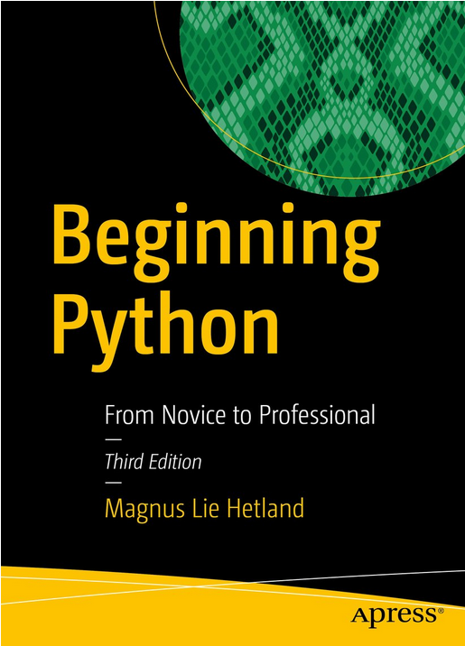

# Beginning Python

## From Novice to Professional

Third Edition by Magnus Lie Hetland

http://tiny.cc/mn2kxz

Gain a fundamental understanding of Python’s syntax and features with this up–to–date introduction and practical reference. Covering a wide array of Python–related programming topics, including addressing language internals, database integration, network programming, and web services, you’ll be guided by sound development principles. Ten accompanying projects will ensure you can get your hands dirty in no time.
Updated to reflect the latest in Python programming paradigms and several of the most crucial features found in Python 3, Beginning Python also covers advanced topics such as extending Python and packaging/distributing Python applications.

What You'll Learn

    Become a proficient Python programmer by following along with a friendly, practical guide to the language’s key features
    Write code faster by learning how to take advantage of advanced features such as magic methods, exceptions, and abstraction
    Gain insight into modern Python programming paradigms including testing, documentation, packaging, and distribution
    Learn by following along with ten interesting projects, including a P2P file–sharing application, chat client, video game, remote text editor, and more

### Who This Book Is For?
Programmers, novice and otherwise, seeking a comprehensive introduction to the Python programming language.
